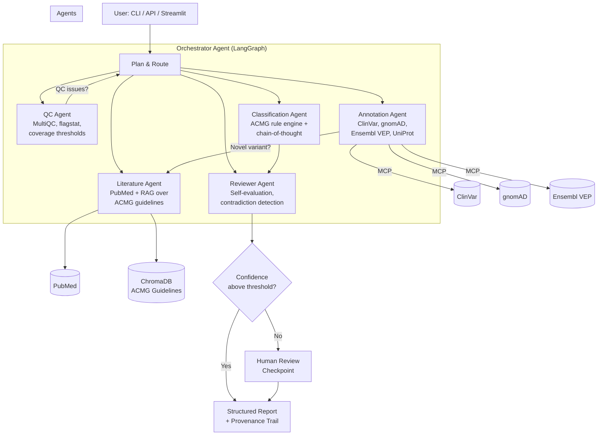

# VariantAgent

Multi-agent clinical variant interpretation system using LangGraph and MCP.

Takes genetic variants (VCF or manual entry), queries public databases (ClinVar, gnomAD, Ensembl VEP, PubMed), applies ACMG/AMP classification criteria with chain-of-thought reasoning, and produces structured interpretation reports with full evidence provenance.

## Architecture



## Features

- **6 specialized agents** with distinct system prompts, tools, and responsibilities
- **Deterministic ACMG rule engine** — LLM reasons about criteria; rules enforce correct classification
- **Dynamic routing** — QC failures skip annotation; novel variants trigger literature search
- **Human-in-the-loop** — confidence-gated checkpoints for low-confidence classifications
- **Self-evaluation** — Reviewer Agent cross-checks all conclusions and flags contradictions
- **Full provenance** — every conclusion traceable to the specific data source and reasoning step
- **Reusable MCP servers** — ClinVar, gnomAD, Ensembl VEP as standalone tools

## Quick Start

```bash
# Clone and install
git clone https://github.com/deepmind11/variantagent.git
cd variantagent
cp .env.example .env  # Add your API keys
make dev

# Analyze a variant
variantagent analyze "chr17:7674220 G>A"

# Or use Docker
docker compose up
```

## Tech Stack

| Component | Technology |
|-----------|-----------|
| Agent framework | LangGraph |
| Tool protocol | MCP (Model Context Protocol) |
| LLM | Claude / GPT-4o (configurable) |
| API backend | FastAPI |
| RAG | ChromaDB + sentence-transformers |
| Data contracts | Pydantic v2 |
| Testing | pytest + VCR.py + deepeval |
| CI/CD | GitHub Actions |
| Observability | LangSmith |

## Project Structure

```
variantagent/
├── src/variantagent/
│   ├── agents/           # 6 LangGraph agents
│   │   ├── orchestrator.py
│   │   ├── qc_agent.py
│   │   ├── annotation_agent.py
│   │   ├── literature_agent.py
│   │   ├── classification_agent.py
│   │   └── reviewer_agent.py
│   ├── tools/            # Parsers and rule engines
│   │   ├── vcf_parser.py
│   │   ├── flagstat_parser.py
│   │   ├── multiqc_parser.py
│   │   └── acmg_engine.py
│   ├── mcp_servers/      # Standalone MCP servers
│   │   ├── clinvar_server.py
│   │   ├── gnomad_server.py
│   │   └── ensembl_vep_server.py
│   ├── models/           # Pydantic data contracts
│   ├── api/              # FastAPI REST API
│   ├── config.py
│   └── cli.py
├── tests/
│   ├── unit/
│   ├── integration/
│   └── e2e/
├── data/
│   ├── test_samples/     # Synthetic test data
│   ├── knowledge_base/   # ACMG guidelines for RAG
│   └── benchmarks/       # ClinGen evaluation data
├── docs/architecture/decisions/
├── streamlit/
├── pyproject.toml
├── Dockerfile
└── docker-compose.yml
```

## Development

```bash
make dev          # Install with dev dependencies
make test         # Run all tests
make lint         # Lint with ruff
make typecheck    # Type check with mypy
make ci           # Run full CI pipeline locally
make serve        # Start FastAPI dev server
make streamlit    # Start Streamlit UI
```

## Data Sources

All data sources are public and free:

- [ClinVar](https://www.ncbi.nlm.nih.gov/clinvar/) — Variant-disease assertions
- [gnomAD](https://gnomad.broadinstitute.org/) — Population allele frequencies
- [Ensembl VEP](https://rest.ensembl.org/) — Variant consequence prediction
- [UniProt](https://www.uniprot.org/) — Protein functional annotation
- [PubMed](https://pubmed.ncbi.nlm.nih.gov/) — Scientific literature
- [ACMG/AMP 2015](https://doi.org/10.1038/gim.2015.30) — Classification guidelines

## Limitations

1. **Not for clinical use.** This is a portfolio/research tool. Clinical variant interpretation requires validated, accredited systems.
2. **Subset of ACMG criteria.** Implements ~17 of 28 ACMG evidence criteria. Functional studies (PS3) and segregation (PP1/BS4) require data not available from public APIs.
3. **LLM reasoning is non-deterministic.** The same variant may receive slightly different criterion assessments across runs. The deterministic rule engine ensures classification consistency given the same criteria.
4. **Rate-limited by public APIs.** NCBI E-utilities allow 3 requests/second without an API key (10/sec with key). Batch analysis of large VCFs will be slow.
5. **No somatic variant interpretation.** This system follows germline ACMG/AMP guidelines. Somatic interpretation (AMP/ASCO/CAP 2017) is a different framework.

## License

MIT
